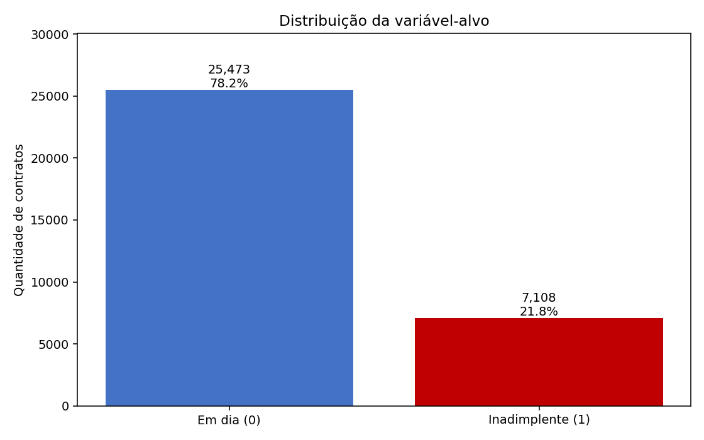
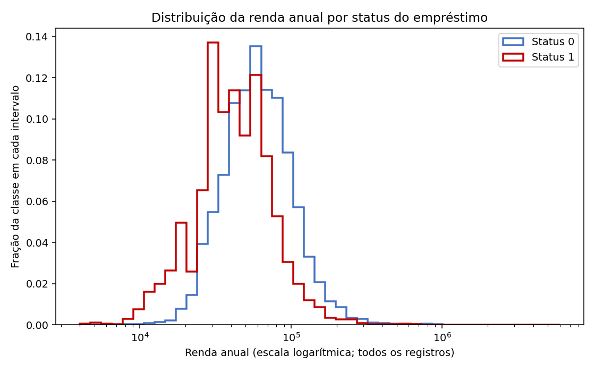
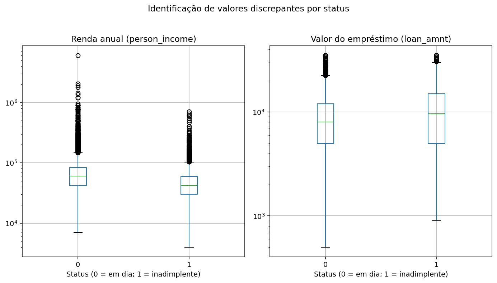
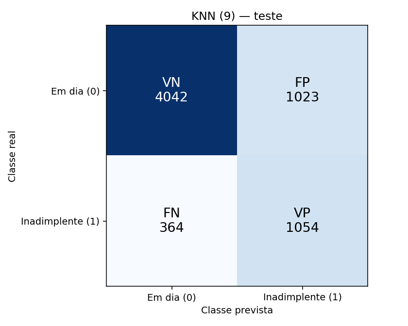
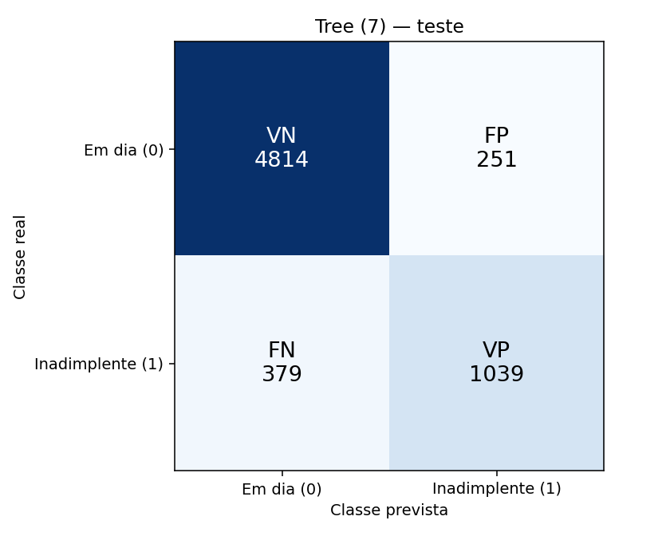
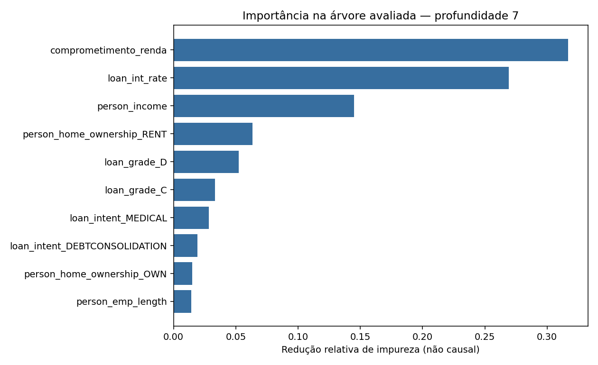

# Risco de crédito: KNN e Árvore de Decisão

Estudo reproduzível de classificação de risco de crédito com KNN e Árvore de Decisão.
Alvo: loan_status=1 indica inadimplência; 0 indica pagamento em dia.

O problema de negócio é apoiar a avaliação de risco de crédito: deixar passar um
inadimplente pode gerar perda do empréstimo, enquanto recusar um bom pagador pode
causar perda de receita e de relacionamento. Comparamos os dois tipos de erro.

## Resumo executivo

Métricas no teste; a classe 1 é inadimplência. FP é um bom pagador marcado como risco;
FN é um inadimplente não detectado.

| Modelo | Parâmetro | Acurácia | Precisão (1) | Recall (1) | F1 (1) | FP | FN |
| --- | --- | ---: | ---: | ---: | ---: | ---: | ---: |
| KNN | K = 9 | 78,61% | 50,75% | 74,33% | 0,6031 | 1.023 | 364 |
| Árvore | profundidade = 7 | 90,28% | 80,54% | 73,27% | 0,7674 | 251 | 379 |

Na base original, 21,82% dos registros são inadimplentes. A renda e a razão empréstimo/renda
apresentam distribuições diferentes entre classes. Foram removidas 165 repetições exatas,
excluídas cinco idades de 123 ou 144 anos e invalidados dois tempos de emprego de 123 anos.
A cópia de trabalho tem 32.411 registros. A variável calculada usa o valor do empréstimo
dividido pela renda anual e multiplicado por 100; não representa parcela mensal. Rendas e
valores de empréstimo extremos foram identificados via boxplot (IQR) e mantidos por serem
raros, porém plausíveis; o balanceamento das classes, restrito ao treino, usa Random
Over-Sampling (reamostragem com reposição da classe minoritária).

O candidato recomendado no cenário ilustrativo é Árvore de Decisão, configuração
7. A árvore tem menor custo se custo_FN/custo_FP for menor que 51,467; no ponto há empate. Na relação oposta, o KNN tem menor custo.

### Principais gráficos

| Distribuição do alvo | Renda por status |
| --- | --- |
|  |  |

| Outliers de renda e valor do empréstimo (IQR) |
| --- |
|  |

| Matriz de confusão — KNN (K=9) | Matriz de confusão — Árvore (profundidade 7) |
| --- | --- |
|  |  |

| Importância das variáveis (Árvore) |
| --- |
|  |

Todos os gráficos estão em `resultados/graficos_eda/` (Etapa 1) e `resultados/avaliacao_final/`
(Etapa 6); os das Etapas 2 a 5 (curvas de validação, sobreajuste e simulação financeira) estão
descritos e exibidos nos documentos indicados na tabela abaixo.

## Onde encontrar a resposta de cada pergunta

| Pergunta | Onde está respondida |
| --- | --- |
| Qual base e qual o objetivo de negócio? | Este README, parágrafos acima |
| Que insights a EDA revelou? | `documentacao/01_eda_e_preparacao.md`, Seção 1 |
| Como nulos e outliers foram tratados, e o impacto no KNN/Árvore? | `documentacao/01_eda_e_preparacao.md`, Seções 1 e 2 |
| Como o overfitting foi identificado e evitado? | `documentacao/02_modelagem.md` |
| Qual modelo colocar em produção, olhando a matriz de confusão? | `documentacao/03_avaliacao_e_veredito.md` |

## Reprodução

Ambiente da execução auditada: Python 3.14.6, com as versões de `requirements.txt`.
Na raiz do projeto, prepare o ambiente e abra o JupyterLab:

~~~sh
python3 -m venv .venv
source .venv/bin/activate
python3 -m pip install -r requirements.txt
jupyter lab
~~~

Abra `notebooks/pipeline_completo.ipynb` e execute todas as células em ordem. Esse notebook
chama `notebooks/03_executar_pipeline.py`, que por sua vez chama, nesta ordem:
1. `notebooks/02_eda_graficos.py` — gera a EDA (Seção 1 de `01_eda_e_preparacao.md` e os
   6 gráficos em `resultados/graficos_eda/`);
2. `pipeline_credito.run_all()` — limpeza, feature, separação, os 8 experimentos e a
   avaliação final; ao final, chama `relatorios_credito.write_reports()`, que escreve as
   Seções 2 a 4 de `01_eda_e_preparacao.md`, além de `02_modelagem.md`, `03_avaliacao_e_veredito.md`
   e este README.

`notebooks/01_inspecao_inicial.ipynb` é uma inspeção opcional; não precisa ser executado.
`notebooks/04_analise_complementar.py` é uma verificação extra opcional (não exigida pelo
problema): roda depois do pipeline principal e completa a seção "Verificação complementar"
de `03_avaliacao_e_veredito.md`. Nenhum desses dois scripts é chamado automaticamente pelos
outros — cada um só roda quando você o executa.

Para rodar tudo sem a interface do Jupyter, na ordem:

~~~sh
python3 notebooks/03_executar_pipeline.py
python3 notebooks/04_analise_complementar.py   # opcional
python3 -m unittest discover -s tests -v
~~~

## Arquivos e leitura

### Dicionário de dados

| Coluna | Tipo | Papel | Descrição operacional |
|---|---|---|---|
| `person_age` | inteiro | preditora | Idade informada da pessoa solicitante. |
| `person_income` | inteiro | preditora | Renda anual informada. |
| `person_home_ownership` | categórica | preditora | Situação de moradia informada. |
| `person_emp_length` | decimal | preditora | Tempo de emprego informado, em anos. |
| `loan_intent` | categórica | preditora | Finalidade declarada do empréstimo. |
| `loan_grade` | categórica | preditora | Classificação de risco do empréstimo na base. |
| `loan_amnt` | inteiro | preditora | Valor solicitado para o empréstimo. |
| `loan_int_rate` | decimal | preditora | Taxa de juros do empréstimo. |
| `loan_status` | inteiro | alvo | 0: pagamento em dia; 1: inadimplência. |
| `loan_percent_income` | decimal | excluída dos preditores | Razão empréstimo/renda em proporção: 0,13 significa 13%; redundante com a feature calculada. |
| `cb_person_default_on_file` | categórica | preditora | Indicador de inadimplência anterior. |
| `cb_person_cred_hist_length` | inteiro | preditora | Comprimento do histórico de crédito, em anos. |
| `comprometimento_renda` | decimal | preditora calculada | `(loan_amnt / person_income) * 100`, em percentual; não representa parcela mensal. |

- `documentacao/dicionario_dados.md`: significado, unidade e papel de cada coluna.
- `documentacao/01_eda_e_preparacao.md`: EDA, limpeza, outliers, engenharia de atributos e separação/balanceamento (Etapas 1 a 4).
- `documentacao/02_modelagem.md`: experimentos de K e profundidade, diagnóstico de overfitting (Etapa 5).
- `documentacao/03_avaliacao_e_veredito.md`: matrizes, custos e veredito de negócio (Etapa 6).
- `resultados/experimentos_corrigidos.csv`: treino, validação e teste das oito configurações.
- `resultados/parametros_selecionados.json`: seleção anterior às predições de teste.
- `resultados/auditoria_execucao.json`: origem das partições, preservação e versões.
- `resultados/avaliacao_final/`: relatórios, predições, matrizes e importância da árvore avaliada.
- `resultados/graficos_eda/`: os 6 gráficos da EDA, incluindo o boxplot de outliers.
- `tests/test_pipeline.py`: provas de ausência de vazamento e consistência dos artefatos.

Os três arquivos consolidados e este README são reescritos a cada execução do pipeline, por
`notebooks/relatorios_credito.py`. Alterações de interpretação devem entrar nesse gerador
(ou em `notebooks/02_eda_graficos.py`, para a Seção 1) para sobreviver à reexecução.

## Dados originais

O CSV `credit_risk_dataset.csv` na raiz é somente leitura para o pipeline; seu hash é
conferido antes e depois de cada execução (`documentacao/integridade_originais.json`).
Saídas ficam em `dados_derivados/`, `resultados/` e `documentacao/`. O índice de origem
não entra como preditor.

Fonte da base de dados:
[base de crédito](https://drive.google.com/file/d/12vm4oQEeH7ZqB6glXEPpkc5V91lQy0mk/view).

## Limitações

O teste e a base completa já foram consultados durante o desenvolvimento anterior. A correção mantém a semente e a divisão e não usa o teste na seleção atual, mas não recupera a independência de um conjunto externo intocado.

As classes não possuem datas para validação temporal; a disponibilidade prévia de juros
e classificação de risco precisa ser confirmada. Custos monetários são hipóteses ilustrativas.
Importância das variáveis não comprova causalidade. Não há garantia de desempenho futuro.
