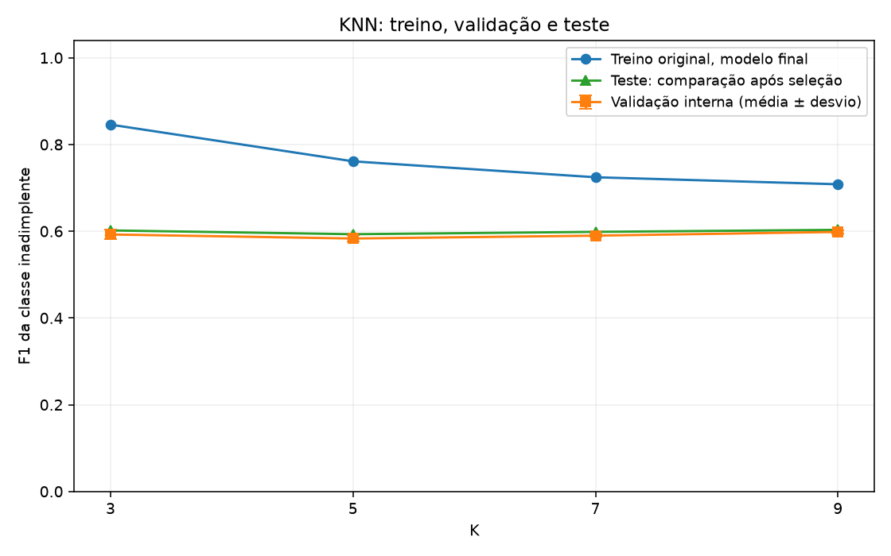
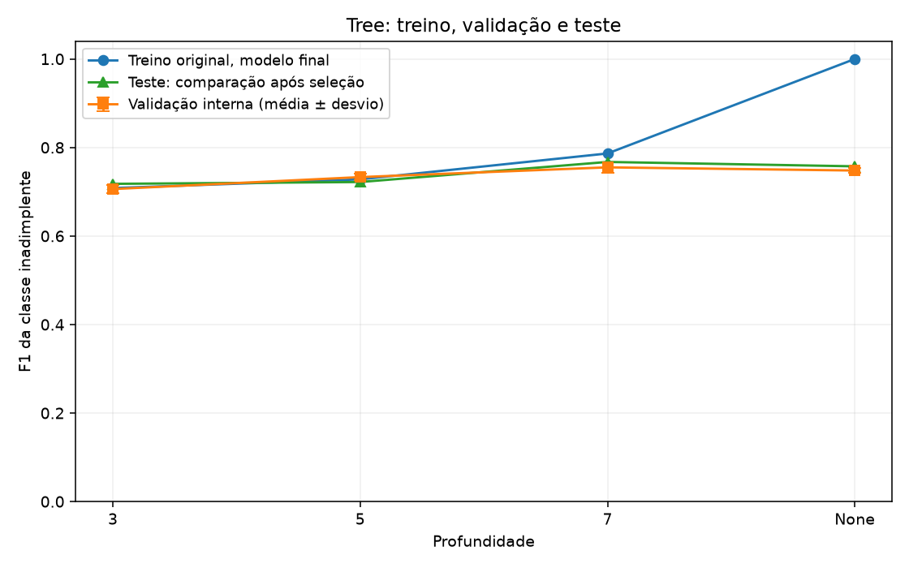

# Modelagem: KNN e Árvore de Decisão

Testamos 4 valores de K no KNN (3, 5, 7, 9) e 4 profundidades na árvore (3, 5, 7 e
ilimitada), sempre comparando F1 de treino contra F1 de validação em 5 dobras
estratificadas, para diagnosticar overfitting antes de tocar no teste.

## KNN (n_neighbors)

| Parâmetro | F1 treino (CV) | F1 validação (CV) | Desvio (CV) | F1 treino (final) | F1 teste (final) | Gap treino→teste (final) |
| --- | --- | --- | --- | --- | --- | --- |
| 3 | 0,8444 | 0,5925 | 0,0107 | 0,8458 | 0,6018 | 0,2440 |
| 5 | 0,7586 | 0,5832 | 0,0076 | 0,7612 | 0,5931 | 0,1680 |
| 7 | 0,7197 | 0,5898 | 0,0031 | 0,7245 | 0,5985 | 0,1259 |
| 9 | 0,7048 | 0,5984 | 0,0040 | 0,7083 | 0,6031 | 0,1051 |

As duas primeiras colunas de F1 (treino e validação) vêm da validação cruzada em 5
dobras, feita só no treino, antes de tocar no teste — é nelas que a seleção se baseia.
As três últimas (treino, teste e o gap entre eles) vêm do ajuste final, feito depois da
seleção, e servem só para descrever o resultado no teste; não influenciam a escolha.

A seleção foi 9, com F1 médio de validação 0,5984.
Usamos o maior F1 médio; em empate exato, K maior no KNN e menor profundidade na árvore.

O intervalo observado do gap treino-validação é 0,1064 a
0,2519. Quanto maior a vantagem no treino, maior o indício de ajuste excessivo;
não aplicamos um limite arbitrário para eliminar modelos.

### Diagnóstico de overfitting

No KNN, K=3 teve F1 médio de treino 0,8444 e F1 de validação 0,5925, um gap de 0,2519. Com K=9, o F1 de treino caiu para 0,7048, mas o F1 de validação subiu para 0,5984 e o gap caiu para 0,1064. Por isso K=9 foi escolhido: ele generalizou melhor entre os quatro valores testados, apesar de a diferença de validação ser pequena.

## Árvore de Decisão (max_depth)

| Parâmetro | F1 treino (CV) | F1 validação (CV) | Desvio (CV) | F1 treino (final) | F1 teste (final) | Gap treino→teste (final) |
| --- | --- | --- | --- | --- | --- | --- |
| 3 | 0,7079 | 0,7060 | 0,0093 | 0,7083 | 0,7179 | -0,0096 |
| 5 | 0,7368 | 0,7331 | 0,0073 | 0,7280 | 0,7220 | 0,0060 |
| 7 | 0,7715 | 0,7551 | 0,0117 | 0,7865 | 0,7674 | 0,0191 |
| None | 1,0000 | 0,7479 | 0,0057 | 1,0000 | 0,7574 | 0,2426 |

As duas primeiras colunas de F1 (treino e validação) vêm da validação cruzada em 5
dobras, feita só no treino, antes de tocar no teste — é nelas que a seleção se baseia.
As três últimas (treino, teste e o gap entre eles) vêm do ajuste final, feito depois da
seleção, e servem só para descrever o resultado no teste; não influenciam a escolha.

A seleção foi 7, com F1 médio de validação 0,7551.
Usamos o maior F1 médio; em empate exato, K maior no KNN e menor profundidade na árvore.

O intervalo observado do gap treino-validação é 0,0018 a
0,2521. Quanto maior a vantagem no treino, maior o indício de ajuste excessivo;
não aplicamos um limite arbitrário para eliminar modelos.

### Diagnóstico de overfitting

Na árvore sem limite de profundidade, o F1 de treino chegou a 1,0000, enquanto o F1 de validação foi 0,7479; o gap de 0,2521 é o sinal mais claro de memorização. A profundidade 7 manteve F1 de treino 0,7715, obteve o maior F1 de validação (0,7551) e reduziu o gap para 0,0164.

